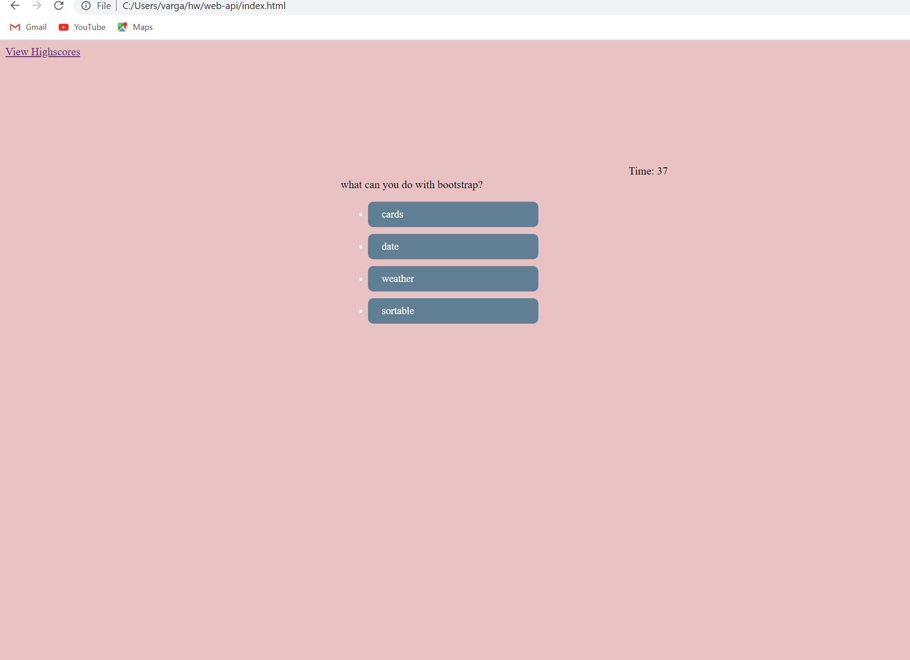

# web-api

## description
This weeks challange was about use making a timed test and have a high score table showing us past game scores>

## Screens shot

## links

https://github.com/e-varg24/web-api

## Process

this project took a lot of sudo code and time to build with javascript. first i made the html and css. Once it was done i started with the sudo code and laid out what i thought was going to work and started my javacript.

